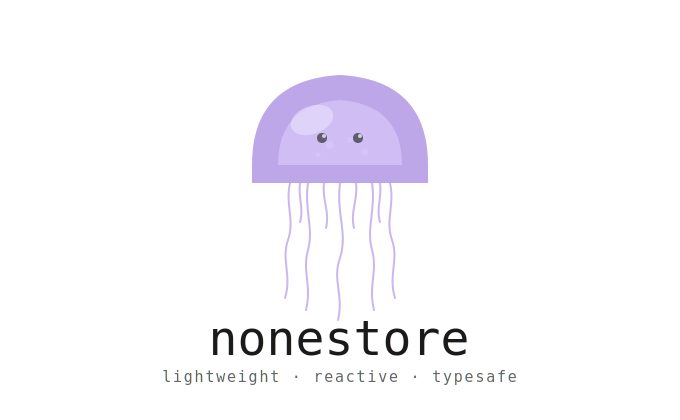

<p align="center">
  
</p>

<p align="center">
  <b>Small. Typed. Reactive.</b><br/>
  React state management powered by Immer — with actions, computed values, middleware, and persistence.
</p>

<p align="center">
  <a href="https://www.npmjs.com/package/nonestore"></a>
  <a href="https://bundlephobia.com/package/nonestore"></a>
  <a href="https://github.com/Wxingxin/nonestore/blob/main/LICENSE"></a>
  <a href="https://www.npmjs.com/package/nonestore"></a>
</p>

---

## Why nonestore?

- **Mutate directly** — Immer handles immutability under the hood, no spread operators
- **Typed actions** — define once, call anywhere, fully inferred types
- **Computed values** — derived state that re-evaluates only when needed
- **Middleware** — logger, validator, time-travel, batching, and dedup built in
- **Persistence** — sync to localStorage with a single config option
- **Tiny** — no bloat, no ceremony, just state

---

## Install

```bash
npm install nonestore immer
```

Peer dependencies:

```bash
npm install react react-dom
```

---

## Quick start

```tsx
import { createStore } from "nonestore";

const [useCounter, counterStore] = createStore(
  { count: 0 },
  {
    actions: {
      increment: (state) => {
        state.count += 1;
      },
      add: (state, amount: number) => {
        state.count += amount;
      },
    },
  },
);

function Counter() {
  const count = useCounter((state) => state.count);

  return (
    <div>
      <p>{count}</p>
      <button onClick={() => counterStore.actions.increment()}>+1</button>
      <button onClick={() => counterStore.actions.add(5)}>+5</button>
    </div>
  );
}
```

That's it. No providers. No reducers. No boilerplate.

---

## Computed values

```tsx
const [useCounter, counterStore] = createStore(
  { count: 0 },
  {
    computed: {
      doubled: (state) => state.count * 2,
      isEven: (state) => state.count % 2 === 0,
    },
    actions: {
      increment: (state) => {
        state.count += 1;
      },
    },
  },
);

function Display() {
  const doubled = useCounter((state) => state.doubled);
  const isEven = useCounter((state) => state.isEven);

  return (
    <p>
      {doubled} — {isEven ? "even" : "odd"}
    </p>
  );
}
```

---

## API

### `createStore(initialState, config?)`

Creates a store and returns a bound React hook plus the store instance.

```tsx
const [useShop, shopStore] = createStore(initialState, config);

// In a component — only re-renders when total changes
const total = useShop((state) => state.total);

// Outside a component
shopStore.actions.addItem(item);
shopStore.getState();
```

### `create(initialState, config?)`

Framework-agnostic store without the React hook.

```ts
import { create } from "nonestore";

const store = create(
  { count: 0 },
  {
    computed: {
      doubled: (state) => state.count * 2,
    },
    actions: {
      increment: (state) => {
        state.count += 1;
      },
    },
  },
);

store.getState(); // { count: 0, doubled: 0 }
store.actions.increment();
store.getState(); // { count: 1, doubled: 2 }
store.subscribe((state) => console.log(state));
store.destroy();
```

**Store instance methods:**

| Method                           | Description                                     |
| -------------------------------- | ----------------------------------------------- |
| `getState()`                     | Returns current state including computed values |
| `setState(updater)`              | Manually update state via Immer producer        |
| `subscribe(listener, selector?)` | Subscribe to state changes, optionally scoped   |
| `actions.someAction(...args)`    | Call a defined action                           |
| `destroy()`                      | Tear down subscriptions and clean up            |

---

## Middleware

nonestore ships with five built-in middleware functions.

```ts
import {
  createStore,
  logger,
  validate,
  timeTravel,
  batch,
  dedup,
} from "nonestore";

const [useSettings] = createStore(
  { theme: "light", fontSize: 14 },
  {
    middlewares: [
      logger({ collapsed: true, diff: true }),
      validate((state) => {
        if (!state.theme) return "theme is required";
      }),
    ],
  },
);
```

| Middleware         | Description                                          |
| ------------------ | ---------------------------------------------------- |
| `logger(options?)` | Logs state changes to the console with diffs         |
| `validate(fn)`     | Throws or warns when state violates a rule           |
| `timeTravel()`     | Records history for undo/redo                        |
| `batch()`          | Batches multiple synchronous updates into one render |
| `dedup()`          | Skips updates when state is shallowly unchanged      |

---

## Persistence

Pass a `persist` config to sync state with `localStorage`. The store hydrates automatically on creation.

```ts
import { create } from "nonestore";

const store = create(
  { theme: "light", fontSize: 14 },
  {
    persist: {
      key: "app-settings",
      pick: ["theme"], // only persist the fields you need
    },
  },
);
```

---

## TypeScript

nonestore is written in TypeScript and fully typed. Pass your state type as a generic for explicit inference:

```ts
type CartState = {
  items: { id: string; qty: number }[];
  coupon: string | null;
};

const [useCart, cartStore] = createStore<CartState>(
  { items: [], coupon: null },
  {
    computed: {
      total: (state) => state.items.reduce((n, i) => n + i.qty, 0),
    },
    actions: {
      addItem: (state, item: { id: string; qty: number }) => {
        state.items.push(item);
      },
      applyCoupon: (state, code: string) => {
        state.coupon = code;
      },
    },
  },
);
```

---

## Multiple stores

nonestore encourages small, focused stores rather than one giant global store.

```tsx
const [useUser]    = createStore({ name: '', role: 'guest' }, { ... })
const [useCart]    = createStore({ items: [] },               { ... })
const [useTheme]   = createStore({ mode: 'light' },           { ... })
```

Each store is independent — no root reducer, no combineReducers.

---

## Local development

```bash
npm install
npm run lint
npm run test
npm run build
```

---

## Contributing

Pull requests are welcome! Please open an issue first to discuss what you'd like to change.

→ [github.com/Wxingxin/nonestore](https://github.com/Wxingxin/nonestore)

---

## License

MIT © [Wxingxin](https://github.com/Wxingxin)
