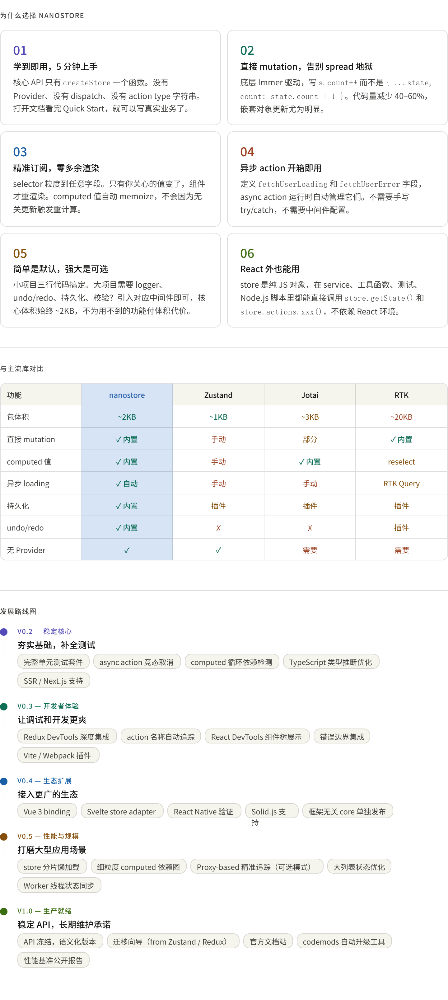

给你两份内容——推荐理由和发展路线图。补充几点给你说话用的**核心论点**：

---

**推荐时最有力的一句话：**

> "其他库要么简单但不够用，要么强大但学习成本高。nanostore 的目标是让简单的事情不用思考，让复杂的事情有路可走。"

---

**发展方向上最值得重点投入的两个方向：**

`v0.3 的开发者体验`是优先级最高的。用户愿不愿意长期用一个库，调试体验占很大比重。Redux 之所以还有这么多用户，DevTools 功不可没。

`v0.4 的多框架支持`是第二重要的。核心 `create()` 本来就是框架无关的，给 Vue / Svelte 加 binding 成本很低，但能把潜在用户群扩大好几倍。把框架无关的 `core` 单独发布成 `nanostore-core`，各框架 adapter 分开发布，这是目前 Zustand、Valtio 都在走的路，验证过是对的。
